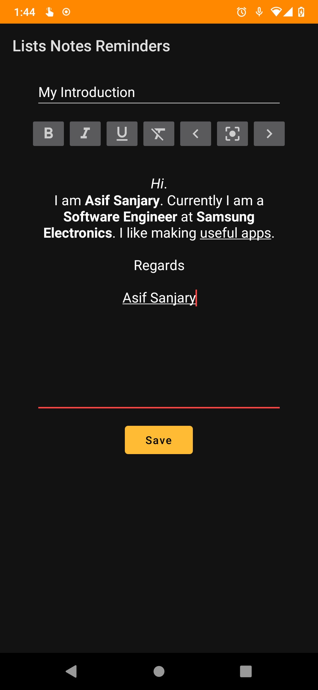

# To-Dos Notes Reminders App
An Android App to record your notes, todos and reminders.
## How to run the app
1. Open Android Studio on your PC.
2. Select **Get from Version Control**, Paste the url `https://github.com/asifsanjary/ListsNotesReminders.git` and Clone the project.
3. Now connect your phone to PC via USB cable (Don't forget to turn on Developer Mode and USB Debugging and ticking the pop-up when Android Studio tries to connect with the phone).
4. Run Android Studio.

## Android Stack
LiveData, ViewModel, Room Database, ExecutorService

## Tasks
- [x] Make A Simple Android App for note editing
- [x] Create Display Multiple Notes on Android App and save on Local DB
- [x] Edit multiple Notes on Android App
- [x] Add separate section for ToDos, Notes and Reminders
- [x] Add ToDo Page
- [ ] Add Reminders Page
- [ ] Export All Data

## Here is the current screenshot of the development.
Front-page Layout             |  Editor Layout
:-------------------------:|:-------------------------:
  |  
