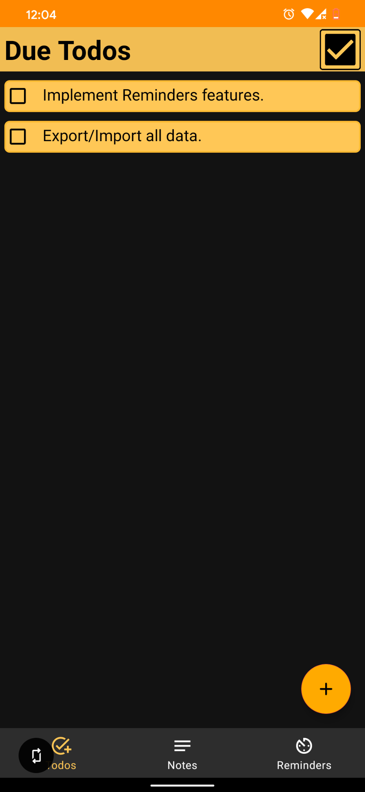

# To-Dos Notes Reminders App

An Android App to manage your Todo-List, Notes and Reminders.

## Download App

[Click to download apk](https://github.com/asifsanjary/ListsNotesReminders/releases/download/v0.04/Todos.Notes.Reminders.apk)

## Here is the current screenshot of the development.

|                                                                  |                                                                 |
| :-----------------------------------------------------------------------: | :-----------------------------------------------------------------------: |
| Due To-Do List | Completed To-do List |
|  |  |
| Notes List | Note Editor |
|  |  |

## Android Stack

LiveData, ViewModel, Room Database, ExecutorService

## Tasks

- [x] Make A Simple Android App for note editing
- [x] Create Display Multiple Notes on Android App and save on Local DB
- [x] Edit multiple Notes on Android App
- [x] Add separate section for ToDos, Notes and Reminders
- [x] Add ToDo Page
- [ ] Add Reminders Page
- [ ] Export All Data

## License

Copyright (c) Asif Sanjary. All rights reserved.

Licensed under the [GPL-3.0 License](LICENSE) license.
